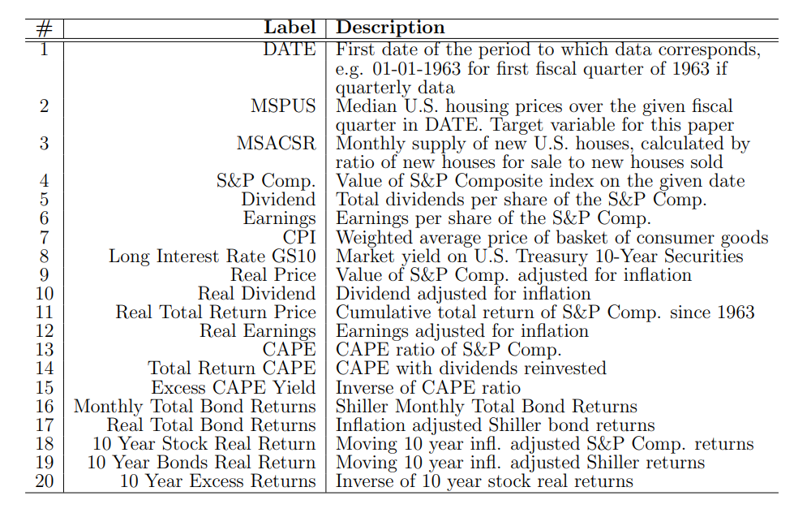
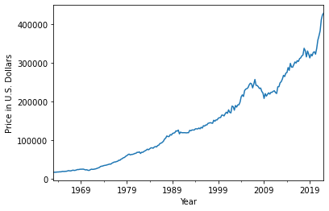
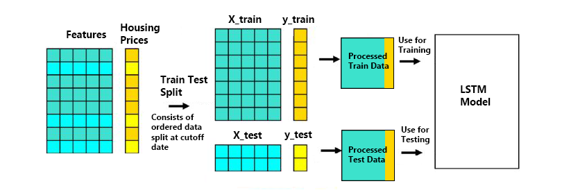
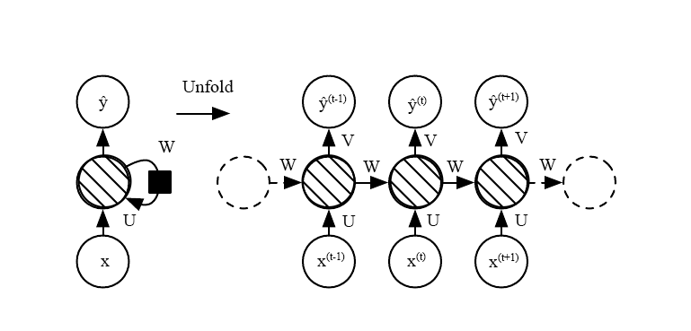
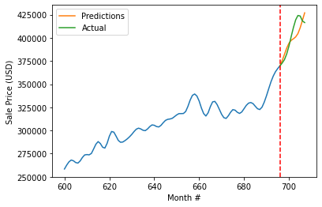
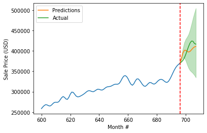
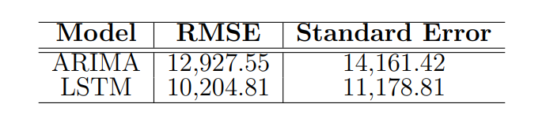

# Predicting Long-Term U.S. Housing Price Trends Using a Long Short-Term Memory Neural Network

UCLA Master's Thesis, Copyright 2022

Full Paper [here](https://github.com/hsdistefa/mas-thesis/blob/master/manuscript/Harrison_DiStefano_MAS_Thesis.pdf)

## Installation

Install Python 3.10 and miniconda, then in a new conda environment run

```
git clone https://github.com/hsdistefa/mas-thesis
cd mas-thesis/
pip install -r requirements.txt
```

To run, open a new jupyter notebook by running the following in the same conda environment used for installation

```
jupyter notebook
```

Then navigate to one of the .ipynb files and run


## Abstract
Housing prices affect everyone. In this paper we establish a potential method of predicting long term home sale prices in the United States using an LSTM neural network model. We took publicly available macro economic data, then massaged it into a manageable form using cubic spline interpolation and logarithmic differencing. We then introduce the LSTM model using feature standardization, min-max normalization, and an Adam optimizer for backpropogation. After training the network on preceding data, we found that the network was able to provide predictions that coincided with similar market movements.

## Data

The United States housing price and new housing supply data used for training and testing is taken from the Federal Reserve Bank of St. Louis website (FRED). These time series data sets contain 236 quarterly median housing prices in the U.S. from January 1963 until January 2022 and 712 monthly new U.S. housing prices in the U.S. from January 1963 until April 2022.

Economic data is taken from Robert Shiller's data set used in his book **Irrational Exuberance** and consists of 1,816 rows of monthly economic data from January 1871 until May 2022.



Below is a plot of the housing sales prices.



Links to data sources:

- [Median Sales Price of Houses Sold for the United States](https://fred.stlouisfed.org/series/MSPUS)
- [Monthly Supply of New Houses in the United States](https://fred.stlouisfed.org/series/MSACSR)
- [Economic Data](http://www.econ.yale.edu/~shiller/data.htm)

## Methodology

We first massage the data into a single dataframe. We use cubic spline interpolation to change the quarterly price data into monthly data to match all other economic data, we do this to keep as many data rows as possible for the neural network. Then the beginning and end of the economic data are removed to match the size of the price data, columns that may leak future information are removed, and the rows containing last few null values found in 2022 are removed. In the end we are left with 708 rows of monthly data and 18 feature columns from 1969 to 2021.

The time series is then differenced using logarithmic differencing on most of the columns to achieve stationerity of the data. 

The transformed data is then split into 95/5 train/test sets at a cutoff date such that the first 95% of months will be used to train the model, and the forecasting results will be tested against the last 5%.

Finally, to minimize the effects of columns with wide ranges on the model, we perform standardization on the economic data (feature) columns and min-max normalization on the price (target) column. 

This process is summarized in the following diagram:



## Model Architecture

We use a multivariate LSTM neural network to model housing prices across time using various macro economic factors to predict future trends. Below is a flow diagram of the recurrent and unfolded architecture of the LSTM with inputs $x^{(t)}$ and predictions $\hat{y}^{(t)}$ at time $t$ with weights $U$, $V$, and $W$.



Where the circles with diagonal lines represent standard LSTM memory cells with input, output, and forget gates.

The LSTM is then trained using an Adam optimizer for back-propogation.


## Results

The LSTM model is run to forecast

The figure below shows the LSTM model forecasts



This is compared to a standard ARIMA model using grid search for hyperparameters



And the model errors can be compared in this table:




